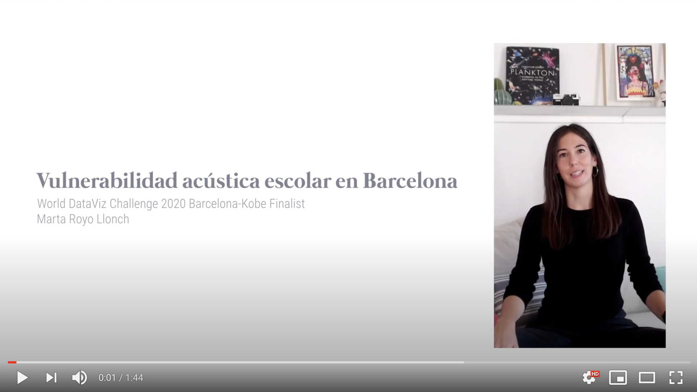

# world-dataviz-challenge-2020
Everything related to the generation of an infographic using data from Barcelona's Open Data portal submitted to the World Data Viz Challenge 2020 Barcelona-Kobe contest. 

## Acoustic vulnerability of schools in Barcelona  
The infographic uses data on acoustic records taken during daytime throughout the city in 2017 to detect those schools that are in areas with acoustic levels that exceed the limits set for school areas (60db(A)).  

This respository contains all the data and code to generate the base figures used in the infographic I have submitted to the challenge. Data analysis has been done with `R v4.0.3` in R studio, and the structure of the repository is the following:  

* `data/` contains all data used in the project. Shapefiles for neighborhood mapping come from [martgnz](https://github.com/martgnz/bcn-geodata.git)'s github, while the rest is available in the [Open Data Barcelona portal](https://opendata-ajuntament.barcelona.cat/ca). Those files that contain the suffix `noaccents` have been modified in order to eliminate catalan characters that could mess up with processing in R.  
* `code/` contains the `Rmarkdown` file with the code to generate the analysis, but you can have a look at the `html` version [here](https://martaroyo.github.io/world-dataviz-challenge-2020/WDVC_BCN_KOBE_2020.html)  

You can download the infographics in [English](https://www.dropbox.com/s/8invvizv3s7uqrx/ENG_MartaRoyoLlonch_WDVC2020_BCN_KOBE.png?dl=0), [Spanish](https://www.dropbox.com/s/3pwur97t6on2z9y/ESP_MartaRoyoLlonch_WDVC2020_BCN_KOBE.png?dl=0) and [Catalan](https://www.dropbox.com/s/yfm2ugtx35imio6/CAT_MartaRoyoLlonch_WDVC2020_BCN_KOBE.png?dl=0).

Here's a short video in Spanish I prepared for the final, explaining how I made the infographics and what it is about:

Have a look at the english version of the infographics below ;)

